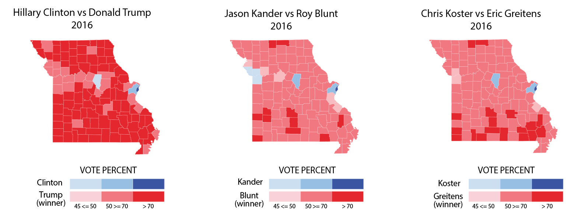
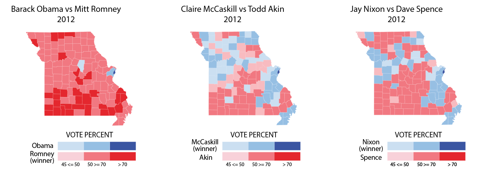
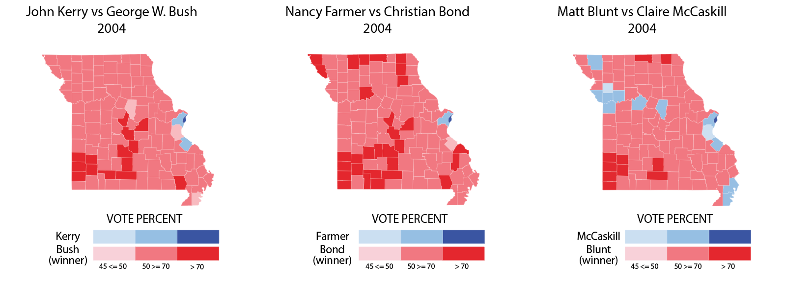
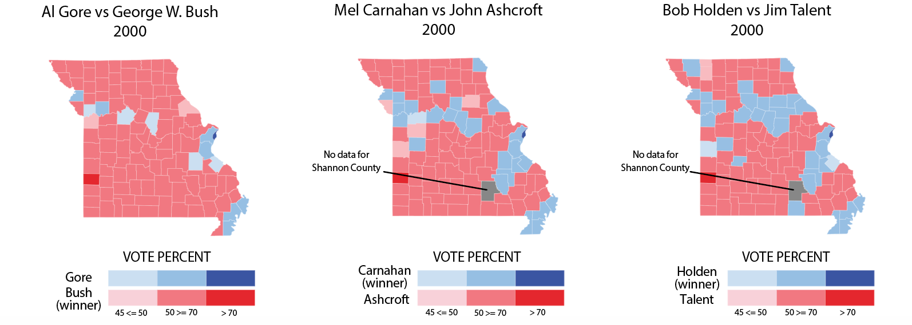

Trump victory most dominant in 20 years

Donald Trump swept to victory in the 2016 election with 306 Electoral College votes to Hillary Clinton's 232. By running such a controversial campaign, a common talking point leading up to election day was how much Trump's divisive rhetoric would affect Republican candidates on the down ballot. While it is true that senator Roy Blunt and governor Eric Greitens did both receive a lower percentage of the vote than Trump, it was stil lenough for both of them to win their respective races. Below we take a look at the last four elections where the U.S. president, U.S. Senate and Missouri governor races have all aligned in the same year, and see how 2016 differed from the past.

Donald Trump took Missouri by a 16-point margin, the largest by a Republican since Bill Clinton won the state in 1996. Trump dominated all but three counties and St. Louis City, and it wasn't ever close. The race for the U.S. senate was far closer than for president. In the weeks prior to the election, Jason Kander crept closer and closer to Roy Blunt in the polls, but ended up falling short, as Blunt took the seat by three percentage points. Looking at the results map, however, it didn't look as close. Eric Greitens and Chris Koster's race for Missouri governor was a six-point victory for Greitens, and the result map looked remarkably similar to the race for governor.

Mitt Romney dominated Missouri in 2012, beating Barack Obama by a 10-point margin. Romney matched Trump and took all but three counties and St. Louis City, but the races for U.S. Senate and Missouri governor told a different story. Democrat Claire McCaskill won her race for the U.S. Senate against Todd Akin by a 16-point margin, after Akin drew ire for his <a href="https://https://www.youtube.com/embed/yKa5CY-KOHc" target="blank"> comments on "legitimate rape</a>." Democrat Jay Nixon was re-elected as governor in a 12-point victory over Dave Spence. Overall, it was the largest divergence from the U.S. presidential race since 1996.

George W. Bush more than doubled his margin of victory in his re-election in 2004. The victory was even greater for Christian Bond in the race for the U.S. Senate, in what was a 13-point difference and a similar trend in county-voting as the presidential race. The gubernatorial was the closest of any of the three major races, with Matt Blunt narrowly beating Claire McCaskill by just 3 points. looking at the results maps, 2004 is the closest to the 2016 election, with little divergence between the two.

The 2000 elections were the tightest of all the races under focus. George W. Bush won back the state for the Republicans by just three points, after consecutive victories for the Democrats under Bill Clinton. Jean Carnahan, wife for Mel Carnahan, still won the race for the U.S. Senate after Mel died in a plane accident just three weeks before polling day. The closest race of all was the gubernatorial race, where Bob Holedn beat Jim Talent by just 0.9 percentage points, or 21,445 votes.

*Mel Carnahan was deceased at time of election.  His wife, Jean Carnahan, served as U.S. senator until November, 2002, when she lost in a special election to Jim Talent.

Overall, the 2016 elections were something Missouri hasn't seen in the last 20 years. Trump's 16-point domination meant that the presidential race in the state was overshadowed by the two immediate down-ballot races.

